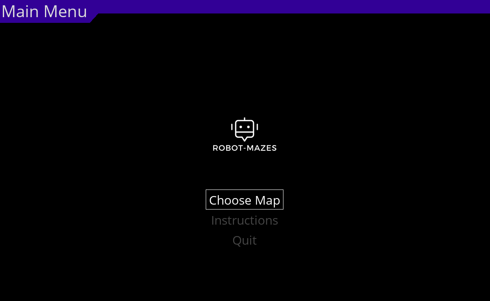
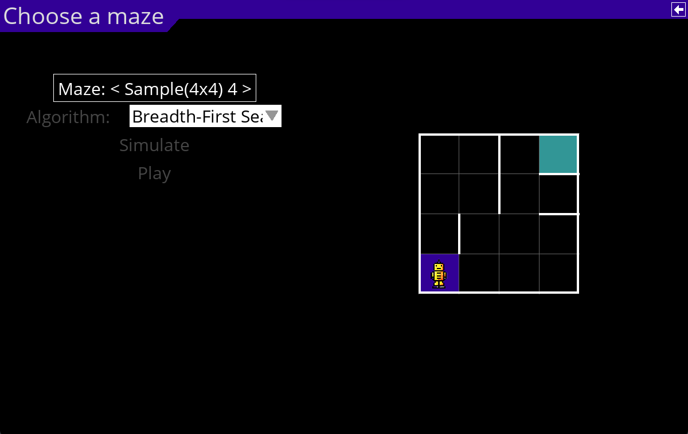
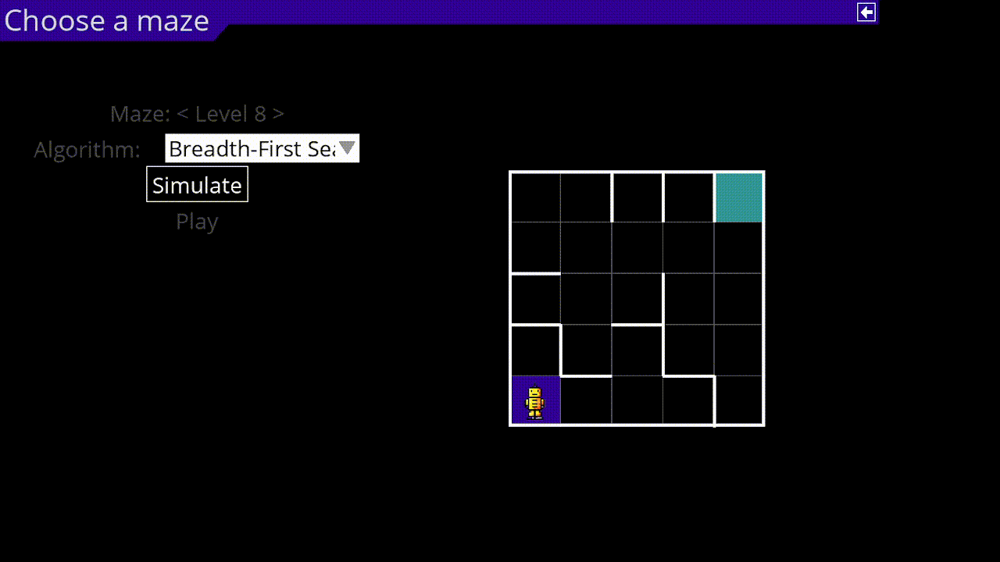
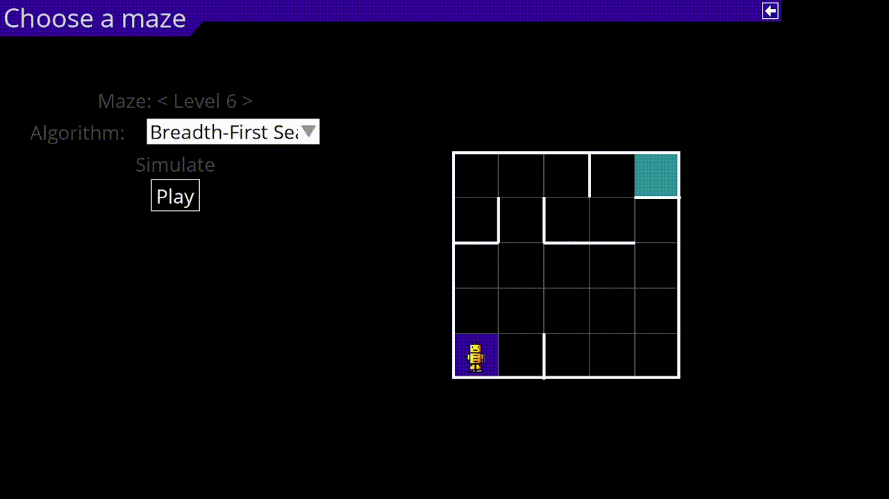

# Robot Mazes

Just a simple python program to implement the game proposed by Erich Friedman
[Robot Mazes](https://erich-friedman.github.io/puzzle/robot/) and AI capable of solving it.

# Dependencies
The project was done using Python 3.8.13

Additionally, to execute the program via python script, the following dependencies need to be installed in a python environment.
```
pygame == 2.1.2
pygame-menu == 4.2.7
```
If pip is available the dependencies can be installed with
```
pip install -r requirements.txt
```

# Execution
To play the game simply run the script main.py that is located inside src from the root of the project.
```
python3 src/main.py
```

Alternatively, you can just run the executables for windows and linux present in the root folder.
### Windows terminal:
```
./robot_mazes_win.exe
```

### Linux bash:
```
./robot_mazes_linux
```

# Project Structure

All code is in src folder.

- **algorithms -** everything related to AI
- **menu -** everything related to the menus of the game
- **view -** aspects related to the graphics of the game
- **model -** aspects related the data of the game
- **controller -** aspects related to the execution of the game and simulation
- **benchmark -** code related to performance analysis
- **test -** code related to testing


# How to play

## Main Menu
In the main menu the user can change the selected option with the arrow keys and select the menu using enter 


## Choose A Maze
In this menu the user can change the selected option with arrow up and arrow down, change the maze using arrow left and arrow right. Finally the user can open the algorithm dropdown with enter and select the multiple algorithms using the arrow keys and enter. 


## Simulate
This menu allows the user to see the result of the algorithm selected applied to a certain maze. An animation of the robot is shown along with some statistics


## Play
This menu allows the user to play the game. The user might choose movements by using the arrow keys, start a simultaion with enter, erase movements with backspace and ask for tips by clicking the light bulb.
